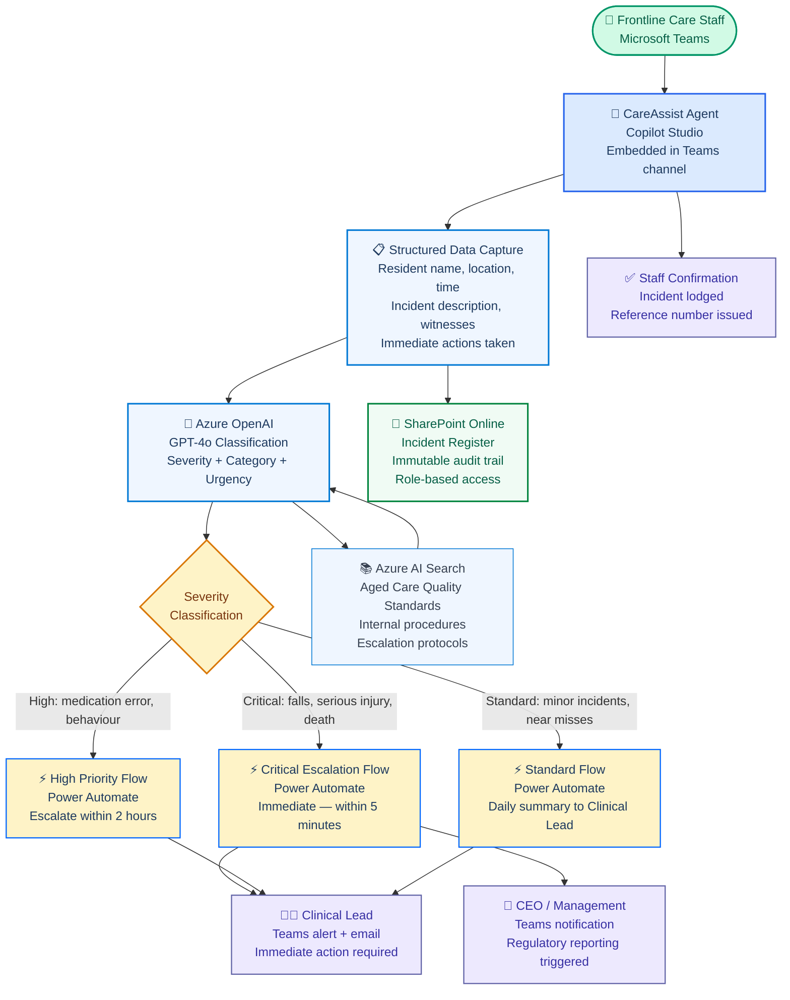

# CareAssist — Clinical Incident Triage Agent
## Copilot Studio + Azure OpenAI + Power Automate — Aged Care Compliance

**Prepared by:** Arsh Wafiq Khan Chowdhury — Technology Consultant, Sydney NSW
**Date:** March 2026 · **Version:** 1.0
**Stack:** Microsoft Copilot Studio · Azure OpenAI (GPT-4o) · Power Automate · SharePoint Online · Microsoft Teams · Azure AI Search
**Classification:** Portfolio artefact — original design. Client details fictionalised.

> CareAssist is an AI-powered clinical incident triage agent designed for aged care providers. It enables frontline care staff to report incidents via Microsoft Teams using natural language, classifies severity in real time using Azure OpenAI, triggers escalation workflows through Power Automate, and maintains an immutable audit trail in SharePoint — all within the existing Microsoft 365 ecosystem.

---

## Business Problem

Aged care providers operating under the **Aged Care Quality Standards** face a critical compliance obligation: clinical incidents must be identified, reported, and escalated within defined timeframes. The reality in most facilities is far from this standard.

**The scenario:** A 3-location aged care provider with 150 frontline staff manages clinical incidents through paper forms and email. Incidents are completed at point of care, scanned, and emailed to the Clinical Lead. The average time between incident occurrence and management visibility is 48 hours. Under the Aged Care Quality Standards, serious incidents require notification within 24 hours.

**The design question:**

> *"Can we build a Copilot Studio agent embedded in Microsoft Teams that allows staff to report incidents in plain language, automatically classifies severity, escalates critical incidents immediately via Power Automate, and creates an immutable SharePoint audit record — without requiring staff to leave Teams or learn a new system?"*

---

## Architecture



---
### Solution Architecture 


## Conversation Design

### Incident Reporting Flow

The agent uses a guided conversation to capture all mandatory fields under the Aged Care Quality Standards without overwhelming staff with a form.

```
CareAssist: Hi, I'm CareAssist. I can help you report a clinical 
            incident quickly and securely.

            What happened? Describe it in your own words.

Staff:      Mrs Thompson fell in the corridor near room 14 about 
            ten minutes ago. She's with a nurse now but I need 
            to report it.

CareAssist: Thank you. I've noted a fall involving Mrs Thompson 
            near Room 14 at approximately 2:45 PM.

            Is Mrs Thompson conscious and being attended to?

Staff:      Yes, the nurse is with her.

CareAssist: Good. A few quick questions to complete the report:

            What is the resident's full name?
            [ Mrs Margaret Thompson ]

            Was anyone else present when this happened?

Staff:      Just me and Nurse Sarah Chen.

CareAssist: Got it. Last question — were any immediate actions 
            taken beyond calling the nurse?

Staff:      I cleared the area and stayed with her until the 
            nurse arrived.

CareAssist: ✅ Incident lodged. Reference: INC-2026-0847

            Classification: HIGH PRIORITY — Fall with potential 
            injury risk.

            Your Clinical Lead has been notified automatically.
            A full report has been saved to the Incident Register.

            Is there anything else you need to add?
```


### Why Conversational Over Form-Based

A traditional incident form has 12 to 18 mandatory fields. Under stress after a clinical event, frontline staff make errors on forms. The conversational approach extracts the same data through natural dialogue, reducing completion time from 8 minutes to under 2 minutes and improving data quality because the agent asks targeted clarifying questions rather than presenting a blank field.

---

## Azure OpenAI Classification

### Severity Classification Prompt

The agent sends the staff's plain language description to Azure OpenAI for classification before routing to Power Automate.

```
You are a clinical incident classification assistant for an aged 
care facility operating under the Aged Care Quality Standards.

Classify the following incident description by:
1. Severity: critical | high | standard
2. Category: fall | medication_error | behaviour | pressure_injury | 
             choking | infection | near_miss | other
3. Regulatory_flag: true | false
   (true if this incident requires mandatory notification to the 
   Aged Care Quality and Safety Commission)
4. Urgency_note: one sentence explaining the classification

Return as JSON only. No preamble.

Severity definitions:
- critical: death, serious injury, falls with suspected fracture, 
  choking, acute medical emergency, missing resident
- high: medication errors, behavioural incidents causing injury, 
  pressure injuries stage 3+, falls without apparent injury
- standard: near misses, minor falls without injury, 
  environmental hazards identified, low-level behavioural incidents

Incident description:
[INCIDENT_DESCRIPTION]
```

### Classification Output Example

```json
{
  "severity": "high",
  "category": "fall",
  "regulatory_flag": false,
  "urgency_note": "Fall incident involving elderly resident requires 
                   clinical assessment and 2-hour escalation to 
                   Clinical Lead per internal protocol."
}
```

---

## Power Automate Escalation Flows

### Flow 1: Critical Escalation (Triggers immediately)

**Trigger:** SharePoint item created with `severity = "critical"`

**Actions:**
1. Send Teams adaptive card to Clinical Lead with full incident details and one-click acknowledgement
2. Send Teams notification to CEO
3. Send email to registered email addresses for Clinical Lead and CEO
4. Create regulatory notification task in SharePoint (ACQSC mandatory reporting checklist)
5. If not acknowledged within 15 minutes, escalate to On-Call Manager

**Business rationale:** Critical incidents under the Aged Care Quality Standards may require notification to the ACQSC within 24 hours. The 15-minute acknowledgement window ensures no critical incident is missed due to a staff member being unavailable.

### Flow 2: High Priority Escalation (2-hour rule)

**Trigger:** SharePoint item created with `severity = "high"` AND item not acknowledged within 2 hours

**Actions:**
1. Send Teams reminder to Clinical Lead with incident reference
2. Log escalation event in SharePoint audit trail
3. If unacknowledged after 4 hours, escalate to CEO

### Flow 3: Daily Summary Report

**Trigger:** Scheduled — 7:00 AM daily

**Actions:**
1. Query SharePoint for all incidents in last 24 hours
2. Generate summary table by severity and category
3. Send as Teams adaptive card to Clinical Lead and Operations Manager
4. Log report generation in audit trail

---

## Knowledge Base Configuration

The agent is grounded in two document sources via Azure AI Search:

| Source | Content | Purpose |
|---|---|---|
| Aged Care Quality Standards (DOCX) | Official regulatory standards | Agent can answer staff questions about reporting obligations |
| Internal Incident Procedures (PDF) | Facility-specific protocols | Agent can guide staff on what to do after an incident |
| Escalation Matrix (SharePoint list) | Who to contact by severity and time | Power Automate reads this to determine notification recipients |

**Document preparation:** All documents chunked at 512 tokens with 64-token overlap. Headings enriched with descriptive keywords (e.g. "Standard 8: Open Disclosure and Incident Management" rather than "Standard 8").

---

## Governance and Compliance

| Area | Approach |
|---|---|
| Audit immutability | SharePoint versioning enabled — incident records cannot be deleted or overwritten, only appended |
| Access control | Role-based: Frontline staff can create, Clinical Lead can read/update, CEO read-only dashboard |
| Data sovereignty | All data in Microsoft Australia East datacentres via SharePoint Online |
| PII handling | Resident names stored in SharePoint with restricted column permissions — agent displays reference number only in Teams chat |
| Regulatory alignment | Classification logic maps to Aged Care Quality Standards Serious Incident Response Scheme (SIRS) categories |
| Conversation logging | All agent conversations logged to SharePoint for 7 years per Aged Care Act requirements |

---

## Infrastructure

See [`infrastructure/`](infrastructure/) for the complete Azure Bicep deployment.

**Resources provisioned:**
- Azure OpenAI (GPT-4o deployment for classification)
- Azure AI Search (semantic index over standards and procedures)
- Azure Key Vault (all credentials via Managed Identity)
- Storage Account (document ingestion pipeline)

**Deploy:**
```bash
az deployment group create \
  --resource-group rg-careassist-prod \
  --template-file infrastructure/main.bicep \
  --parameters @infrastructure/parameters.json
```

---

## Key Design Decisions

| Decision | Approach | Rationale |
|---|---|---|
| Teams as the channel | Embedded in existing Teams environment | Staff already use Teams daily — zero new tool adoption required |
| Conversational over form | Guided NLP dialogue | Reduces completion time and error rate under stress |
| Azure OpenAI for classification | GPT-4o with structured prompt | Consistent classification without rule-based logic that breaks on edge cases |
| Severity routing in Power Automate | Condition-based flow branching | Visual, maintainable, and auditable by non-developers |
| SharePoint as audit layer | Immutable versioned lists | Meets Aged Care Act record-keeping requirements without additional infrastructure |
| Escalation acknowledgement | Teams adaptive card with one-click confirm | Reduces acknowledgement friction for clinical staff who are often mobile |

---

## What I Would Do Differently in Production

| Area | Prototype | Production |
|---|---|---|
| Resident identity | Staff types resident name | Lookup against resident register in Dataverse to prevent naming errors |
| Photo upload | Not supported | Teams file attachment processed by Azure AI Document Intelligence |
| Multi-language | English only | Azure AI Translator for CALD (Culturally and Linguistically Diverse) staff |
| Shift handover integration | Manual | Agent queries roster system to attach on-duty staff at time of incident |
| Analytics | SharePoint views | Power BI dashboard: incident trends by location, category, time of day |
| Offline capability | Not supported | Power Apps canvas app as offline fallback for connectivity outages |

---

## Skills Demonstrated

- **Copilot Studio agent design:** Conversation flow, topic design, NLP intent handling, Teams channel deployment
- **Azure OpenAI prompt engineering:** Structured classification with JSON output contract, regulatory domain knowledge
- **Power Automate:** Multi-trigger escalation flows, adaptive cards, scheduled reports, condition branching
- **RAG grounding:** Azure AI Search over regulatory documents for in-agent policy lookup
- **Governance and compliance design:** Aged care regulatory alignment, audit immutability, data sovereignty, PII handling
- **Business outcome translation:** Every technical decision tied to a compliance or operational outcome

---

*Prepared by Arsh Wafiq Khan Chowdhury — Technology Consultant, Sydney NSW*
*arshwafiq@gmail.com · [linkedin.com/in/arsh-wafiq-khan-chowdhury](https://linkedin.com/in/arsh-wafiq-khan-chowdhury)*
*[github.com/Arshchowdhury/Portfolio_ArshWafiqKhanChowdhury](https://github.com/Arshchowdhury/Portfolio_ArshWafiqKhanChowdhury)*
*Portfolio artefact — methodology demonstration only. All client details fictionalised.*
