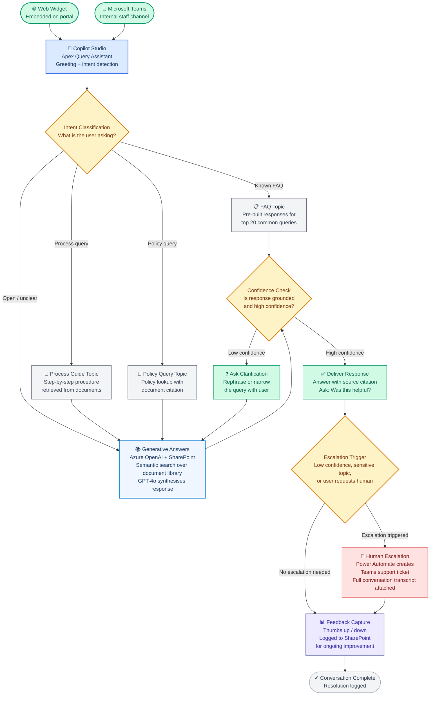

# AI Agent Design: Customer Query Resolution Agent
## Copilot Studio + Azure OpenAI — Knowledge-Grounded NLP Agent

**Prepared by:** Arsh Wafiq Khan Chowdhury — Technology Consultant, Sydney NSW
**Date:** March 2026 · **Version:** 1.0
**Stack:** Microsoft Copilot Studio · Azure OpenAI · SharePoint Online · Power Automate · Teams / Web Channel
**Classification:** Portfolio artefact — original design. Client details fictionalised.

> This document presents an original agent design for a customer-facing query resolution system grounded in internal document knowledge. It covers the business problem, agent architecture, conversation design, knowledge strategy, NLP configuration, guardrails, escalation logic, and governance approach.

---

## Business Problem

Organisations with large internal knowledge bases — policy libraries, product manuals, compliance documents, procedure guides — face a recurring problem: customers and staff cannot find answers quickly. Support teams spend significant time answering questions that are already documented, and customers experience frustration when they cannot self-serve.

**The scenario:** A mid-size financial services firm manages a 400-document policy and procedure library across SharePoint. Front-line staff and customers submit hundreds of repetitive queries per week through email and phone. Average resolution time is 24–48 hours. 60% of queries are answerable from existing documentation.

**The design question:**

> *"Can we build a Copilot Studio agent, grounded in our SharePoint document library, that resolves the majority of common queries instantly using natural language, while gracefully escalating complex or sensitive queries to a human?"*

---

## Agent Overview

| Attribute | Detail |
|---|---|
| **Agent Name** | Apex Query Assistant |
| **Platform** | Microsoft Copilot Studio |
| **Primary Channel** | Embedded web widget + Microsoft Teams |
| **Knowledge Source** | SharePoint Online document library (400 documents) |
| **AI Model** | GPT-4o via Azure OpenAI (Copilot Studio generative answers) |
| **User Types** | External customers, internal front-line staff |
| **Escalation Target** | Human support queue via Teams channel |
| **Languages** | English (primary) |

---

## Architecture



---

## Knowledge Strategy

The agent's effectiveness depends entirely on how knowledge is structured and surfaced. This was the most important design area.

### Knowledge Source Configuration

| Source | Content | Indexing Method |
|---|---|---|
| SharePoint document library | 400 policy, procedure, and product documents | Copilot Studio SharePoint connector — semantic indexing |
| FAQ SharePoint list | Top 20 common Q&A pairs, manually curated | Structured topic responses (not generative) |
| Metadata tags on documents | Category, audience, effective date, version | Used to filter responses by relevance and recency |

### Why Generative Answers Over Manual Topics

A key design decision was using Copilot Studio's **Generative Answers** capability rather than building hundreds of manual topics. Manual topics require predefined trigger phrases, which fail when users phrase questions unexpectedly. Generative Answers uses semantic similarity to retrieve relevant document chunks and synthesises a natural language response via GPT-4o.

This means a user asking "what happens if I miss a payment deadline?" will receive the same relevant policy content whether they ask it that way, or as "payment overdue policy", "late payment consequences", or "I forgot to pay on time."

### Document Preparation for Optimal Retrieval

Documents were prepared specifically for agent grounding:

- Headings made descriptive and keyword-rich (not "Section 3.2" but "Late Payment Consequences and Penalties")
- Long documents split into logical chunks under 2,000 tokens
- Duplicate and outdated documents removed before indexing
- Metadata applied consistently: document type, topic category, effective date, audience (customer-facing vs internal)

This preparation step is often overlooked and is the primary reason agent responses are poor quality in most deployments.

---

## Conversation Design

### Greeting and Intent Detection

The agent opens with a short, professional greeting and immediately invites the query. No long preamble. No forced menu navigation.

```
Agent: Hi, I'm Apex — your support assistant. I can answer 
       questions about our policies, procedures, and products 
       using our knowledge library.

       What would you like to know today?
```

Intent classification happens through Copilot Studio's built-in NLP. The agent routes to:
- A **pre-built FAQ topic** for the 20 most common questions (faster, more controlled response)
- A **generative answers topic** for everything else (broader coverage, document-grounded)

### Response Format

Every generative response includes:
1. A direct answer in plain language (no jargon from source document)
2. The source document name and section for traceability
3. A confirmation prompt: "Was this helpful? Yes / No / I need more help"

```
Agent: According to our Late Payment Policy (Section 4.1, 
       effective January 2026), a penalty fee of $25 applies 
       after 7 days. You'll also receive an automated reminder 
       on day 3 and day 7.

       Was this helpful?
       [ ✅ Yes ] [ ❌ No ] [ 👤 Speak to someone ]
```

### Clarification Flow

When the agent cannot retrieve a high-confidence answer, it does not fabricate. Instead it narrows the query:

```
Agent: I want to make sure I give you the right information. 
       Could you tell me a bit more about your situation?

       Are you asking about:
       [ Payment deadlines ] [ Account suspension ] 
       [ Dispute process ] [ Something else ]
```

This guided clarification dramatically improves retrieval accuracy on the second attempt.

---

## NLP Configuration

### Intent Triggers

| Topic | Trigger Phrases (examples) | Method |
|---|---|---|
| Late payment | "missed payment", "overdue", "penalty fee", "payment deadline" | Manual + generative |
| Account closure | "close my account", "cancel", "terminate" | Manual — sensitive, routes to human |
| Document request | "send me", "copy of", "I need the document" | Manual |
| General policy | Any policy-related natural language query | Generative answers |
| Process guidance | "how do I", "what are the steps", "how to" | Generative answers |
| Complaint | "unhappy", "complaint", "not satisfied", "escalate" | Manual — always escalates |

### Out-of-Scope Handling

The agent was explicitly configured with a system instruction defining its scope:

```
This agent answers questions about [Firm] policies, procedures, 
and products using the approved document library. It does not 
provide legal advice, financial advice, or account-specific 
information. If asked about anything outside this scope, 
it acknowledges the limitation and offers to connect the 
user with a human.
```

This prevents the agent from hallucinating answers outside its knowledge domain — a critical governance requirement.

---

## Escalation Design

Human escalation is triggered in four scenarios:

| Trigger | Mechanism | Outcome |
|---|---|---|
| User explicitly requests a human | "speak to someone" button or phrase detection | Immediate handoff |
| Complaint or sensitive language detected | Keyword trigger topics | Automatic escalation with sentiment flag |
| Agent low confidence after two clarification attempts | Condition in generative answers flow | Escalation with transcript |
| Account-specific query | Detected when user provides account number or personal details | Escalation — agent cannot access account systems |

**Escalation handoff process:**

When escalation is triggered, Power Automate:
1. Creates a new item in the support queue SharePoint list
2. Attaches the full conversation transcript
3. Sends a Teams notification to the on-duty support agent
4. Sends the user a confirmation: "I've passed this to our team. You'll hear back within [SLA]."

The human agent receives the full conversation context before picking up the query, eliminating the need for the customer to repeat themselves.

---

## Guardrails and Safety

| Guardrail | Implementation |
|---|---|
| No account-specific data | Agent has no connection to CRM or account systems — cannot retrieve or display personal data |
| No legal or financial advice | Explicit system instruction + topic-level out-of-scope handling |
| Citation required | Every generative response must include source document name — prevents unfounded claims |
| Profanity and abuse detection | Copilot Studio content moderation enabled — abusive interactions logged and escalated |
| Data retention | Conversation transcripts retained for 90 days per compliance policy, then purged |
| PII handling | Agent instructed not to ask for or store personal information — escalates to human if PII is volunteered |

---

## Governance and Compliance

| Area | Approach |
|---|---|
| Document version control | Agent only indexes documents marked "Active" in SharePoint metadata — outdated versions excluded automatically |
| Access control | Agent inherits SharePoint permissions — documents restricted to internal staff are not surfaced to external customers |
| Audit trail | All conversations logged to SharePoint with timestamp, channel, resolution status, and escalation flag |
| Model oversight | Monthly review of low-confidence responses and escalation reasons to identify knowledge gaps |
| Change management | New documents added to SharePoint are indexed within 24 hours — no manual agent update required |

---

## Testing Approach

Before deployment, the agent was tested across three dimensions:

**1. Retrieval accuracy** — 50 real historical support queries were run through the agent. Target: 80% resolved without escalation.

**2. Edge case handling** — Tested deliberately vague, ambiguous, and out-of-scope queries to verify guardrail behaviour.

**3. Conversation flow** — End-to-end user journey testing across web widget and Teams channel, including escalation handoff.

**Acceptance criteria:**
- Resolution without escalation: ≥ 75% of queries
- Response grounded in source document: 100% of generative responses
- Escalation handoff time: < 2 minutes from trigger to Teams notification
- False positive escalation rate: < 10%

---

## Key Design Decisions

| Decision | Approach | Rationale |
|---|---|---|
| Generative Answers over manual topics | GPT-4o grounded in SharePoint | 400 documents cannot be manually mapped to topics — generative coverage is the only scalable approach |
| Pre-built FAQ topics for top 20 | Manual topic responses | High-volume, stable queries benefit from deterministic responses — faster and more consistent than generative |
| Source citation mandatory | System instruction enforces citation | Prevents hallucination and builds user trust — they can verify the answer source |
| Guided clarification over open retry | Structured choice buttons | Reduces user frustration and improves retrieval accuracy more than a free-text retry |
| Power Automate for escalation handoff | Not native Copilot Studio handoff | Allows richer ticket creation, Teams notification, and transcript attachment beyond what the native handoff provides |
| No account system connection | Deliberate architectural decision | Eliminates data privacy risk in the initial deployment — account queries handled entirely by humans |

---

## What I Would Do Differently in Production at Scale

| Area | Prototype Approach | Production Recommendation |
|---|---|---|
| Knowledge indexing | SharePoint connector default chunking | Custom chunking strategy with 500-token overlapping chunks for better retrieval on long documents |
| Multi-language | English only | Azure AI Translator pre-processing for multilingual query support |
| Agent evaluation | Manual test set | Azure AI Foundry evaluation pipeline — automated weekly accuracy benchmarking |
| Personalisation | No user context | Integrate Azure AD user profile to personalise tone and filter documents by user role |
| Analytics | Copilot Studio default analytics | Custom Power BI dashboard tracking resolution rate, escalation reasons, and knowledge gaps over time |
| RAG pipeline | Copilot Studio native | Custom RAG pipeline via Azure AI Search + Azure OpenAI for finer control over retrieval quality |

---

## Skills Demonstrated

This design demonstrates the following capabilities:

- **Agent architecture design:** Multi-channel, knowledge-grounded agent with structured topic routing and generative fallback
- **NLP configuration:** Intent classification, trigger phrase design, out-of-scope handling, and clarification flow
- **Knowledge strategy:** Document preparation, semantic indexing, metadata-driven filtering, and version governance
- **Guardrails and safety:** PII handling, scope enforcement, citation requirements, and content moderation
- **Escalation design:** Human-in-the-loop escalation with Power Automate handoff and full transcript transfer
- **Governance thinking:** Audit trails, access control inheritance, compliance-aware data retention
- **Production thinking:** Honest gap between prototype and production, with concrete improvement recommendations

---

*Prepared by Arsh Wafiq Khan Chowdhury — Technology Consultant, Sydney NSW*
*arshwafiq@gmail.com · [linkedin.com/in/arsh-wafiq-khan-chowdhury](https://linkedin.com/in/arsh-wafiq-khan-chowdhury)*
*[github.com/Arshchowdhury/Portfolio_ArshWafiqKhanChowdhury](https://github.com/Arshchowdhury/Portfolio_ArshWafiqKhanChowdhury)*
*Portfolio artefact — methodology demonstration only. All client details fictionalised.*
