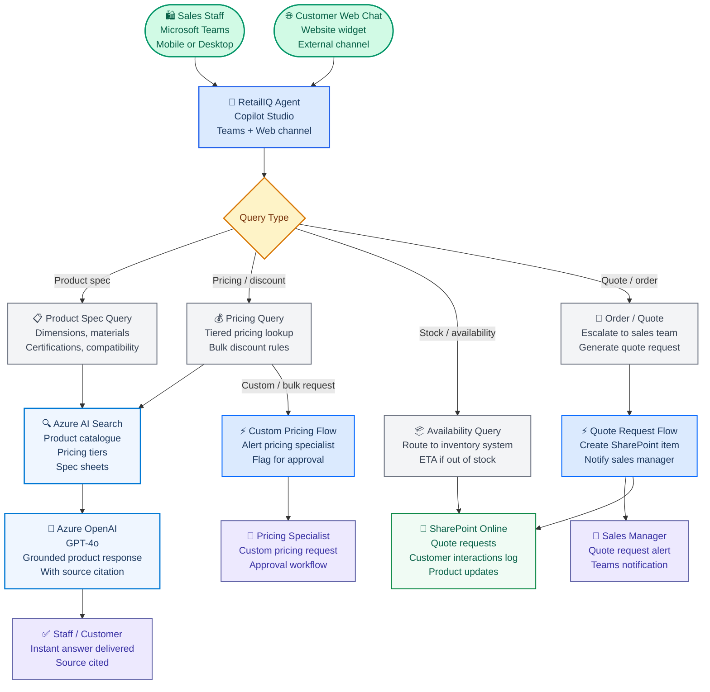

# RetailIQ — AI Sales Assistant Agent
## Copilot Studio + Azure OpenAI + Power Automate — Retail / eCommerce

**Prepared by:** Arsh Wafiq Khan Chowdhury — Technology Consultant, Sydney NSW
**Date:** March 2026 · **Version:** 1.0
**Stack:** Microsoft Copilot Studio · Azure OpenAI (GPT-4o) · Azure AI Search · Power Automate · Microsoft Teams · SharePoint Online · Azure Bicep
**Classification:** Portfolio artefact — original design. Client details fictionalised.

> RetailIQ is an AI-powered sales assistant agent that helps retail sales teams answer product, pricing, and availability queries instantly using a RAG-grounded product knowledge base. Deployed in Microsoft Teams, it reduces the time sales staff spend searching catalogues and chasing pricing approvals, freeing them to focus on customer relationships.

---

## Business Problem

A mid-size Australian retail business with 200 sales staff across 12 locations manages a product catalogue of 8,000 SKUs across three categories. Sales staff spend an average of 35 minutes per shift searching for product specifications, pricing tiers, and stock availability. New staff take 6 to 8 weeks to develop catalogue knowledge sufficient for confident customer conversations.

**The scenario:** A sales rep is with a customer who is asking about bulk pricing for commercial carpet tiles. The rep does not know the tiered pricing off the top of their head, cannot find the right page in the printed catalogue quickly, and the customer walks away without buying.

**The design question:**

> *"Can we build a Copilot Studio agent in Microsoft Teams that allows sales staff to ask natural language questions about any product and receive instant, accurate answers grounded in the actual product catalogue and pricing documents — with an escalation path to a pricing specialist for edge cases?"*

---

## Architecture


---

## Knowledge Base Configuration

The agent is grounded in three document sources indexed by Azure AI Search:

| Source | Content | Format | Update Frequency |
|---|---|---|---|
| Product Catalogue | 8,000 SKUs with specs, dimensions, materials, certifications | PDF + CSV | Weekly |
| Pricing Tiers | Standard, trade, bulk, and promotional pricing rules | Excel → CSV | Daily |
| Spec Sheets | Detailed technical datasheets per product category | PDF | Monthly |

**Indexing strategy:** Product and pricing data is pre-processed into structured chunks grouped by SKU. Each chunk includes the product code as a metadata field, enabling filtered retrieval when the user references a specific SKU directly.

---

## Conversation Design

### Product Specification Query

```
Staff:      What are the specs for the Signature Series carpet tile 
            in graphite?

RetailIQ:   The Signature Series Carpet Tile — Graphite (SKU: SS-CPT-4412) 
            has these specifications:

            Size: 500mm × 500mm
            Pile height: 6mm
            Backing: Fibre-bonded
            Rating: Commercial heavy duty (Class 33)
            Certifications: Green Star compliant, AS/NZS 2454

            Available in: Graphite, Slate, Charcoal, Warm Grey

            Source: Signature Series Spec Sheet v3.2, January 2026

            Would you like pricing or availability for this product?
```

### Pricing Query with Escalation

```
Staff:      What's the price for 500 square metres of the graphite 
            carpet tile?

RetailIQ:   Standard pricing for the Signature Series Graphite 
            (SKU: SS-CPT-4412):

            1–99 m²:   $48.50/m²
            100–499 m²: $44.00/m²
            500+ m²:    $39.50/m² (trade pricing applies)

            For 500 m², the indicative total is $19,750 
            at the 500+ tier.

            Source: Pricing Guide Q1 2026, Commercial Flooring

            For a formal quote or if the customer needs 
            a customised rate, I can raise a quote request 
            for the sales team now.

            [ 📝 Raise Quote Request ] [ ✅ That's enough ]
```

### Quote Request Flow

When the staff member taps **Raise Quote Request**, Power Automate:
1. Creates a SharePoint item in the Quote Requests list with all conversation context
2. Sends a Teams adaptive card to the Sales Manager with customer details and product/quantity
3. Returns a quote reference number to the agent conversation

---

## Power Automate Flows

### Flow 1: Quote Request

**Trigger:** Copilot Studio action — staff taps "Raise Quote Request"

**Actions:**
1. Create SharePoint item: product, quantity, customer context, staff name, timestamp
2. Send Teams adaptive card to Sales Manager with quote details and one-click assign
3. Return quote reference number to agent (displayed to staff in Teams chat)
4. Log interaction in Customer Interaction SharePoint list

**Business outcome:** Removes the need for staff to send emails or fill separate forms to escalate a quote. The full product and pricing context captured in the conversation is automatically attached to the quote request.

### Flow 2: Custom Pricing Approval

**Trigger:** Staff requests pricing below the standard tier or for a volume not in the price guide

**Actions:**
1. Create approval task in SharePoint with requested price, justification, and deal context
2. Send Teams notification to Pricing Specialist with approve/reject adaptive card
3. On approval: return approved price to agent for staff confirmation
4. On rejection: return standard pricing with explanation

---

## Prompt Design

### System Prompt

```
You are RetailIQ, a product knowledge assistant for [Company] sales staff.
Your role is to help sales staff answer customer questions accurately 
and confidently using the product catalogue and pricing guides.

WHAT YOU DO:
- Answer product specification questions using the catalogue
- Provide pricing from the current pricing guide
- Clarify product compatibility and availability
- Raise quote requests when staff need formal pricing

WHAT YOU DO NOT DO:
- Provide pricing that is not in the current pricing guide
- Commit to delivery dates or stock levels
- Offer discounts beyond the published tier structure
- Access customer account or order history

CITATION FORMAT:
Always cite the source document and version for every 
factual answer: Source: [Document], [Version/Date]

ESCALATION:
Always offer to raise a formal quote request when:
- The quantity exceeds the highest pricing tier
- The customer needs a customised arrangement
- The staff member explicitly asks for a quote
```

### Grounding Prompt

```
You are a product knowledge assistant. Answer the staff member's 
question using ONLY the product information provided below.

If the information provided does not contain a confident answer, 
say: "I don't have that detail in the catalogue right now. 
Let me flag this for the product team."

Do not fabricate specifications, prices, or availability.
Always include the source document reference.

RETRIEVED PRODUCT INFORMATION:
{retrieved_chunks}

STAFF QUESTION:
{user_query}
```

---

## Business Impact

| Metric | Before | After (Projected) |
|---|---|---|
| Time per product query | 8–12 minutes | Under 45 seconds |
| New staff ramp-up time | 6–8 weeks | 2–3 weeks |
| Quote request turnaround | 24–48 hours | 2–4 hours |
| Catalogue accuracy errors | Estimated 15% | Near zero (grounded in source) |

---

## Infrastructure

See [`infrastructure/`](infrastructure/) for full Bicep deployment.

**Resources provisioned:** Azure OpenAI, Azure AI Search, Azure Blob Storage, Azure Key Vault — all on Managed Identity with no hardcoded credentials.

```bash
az deployment group create \
  --resource-group rg-retailiq-prod \
  --template-file infrastructure/main.bicep \
  --parameters @infrastructure/parameters.json
```

---

## Key Design Decisions

| Decision | Approach | Rationale |
|---|---|---|
| Two channels: Teams and web | Copilot Studio multi-channel | Internal staff use Teams, external customers use web — same agent, different channels |
| SKU as metadata filter | Product code indexed as filter field | Direct SKU lookups bypass semantic search for exact matches — faster and more reliable |
| Quote flow in Power Automate | Not native Copilot Studio handoff | Richer context attachment and SharePoint logging than native handoff provides |
| Pricing tier in retrieved context | Full pricing table chunk retrieved | Avoids the model interpolating between tiers incorrectly — the full table is always in context |
| Source citation mandatory | System instruction enforces it | Sales staff need to be able to verify and show customers the source |

---

## What I Would Do Differently in Production

| Area | Prototype | Production |
|---|---|---|
| Stock availability | Static SharePoint list | Live ERP integration via Power Automate connector |
| Pricing updates | Manual re-index weekly | Event-driven: price list change triggers automatic re-indexing |
| Customer context | No customer history | CRM integration to personalise responses with account tier |
| Multi-language | English only | Azure AI Translator for multilingual customer web chat |
| Analytics | None | Power BI: query volume by category, escalation rate, quote conversion |

---

## Skills Demonstrated

- **Copilot Studio multi-channel deployment:** Teams and web widget from a single agent
- **RAG grounding:** Product catalogue and pricing indexed in Azure AI Search with metadata filtering
- **Power Automate:** Quote request flow, custom pricing approval workflow, adaptive cards
- **Prompt engineering:** System prompt with explicit scope limits, grounding prompt with citation enforcement
- **Business outcome translation:** Every design decision tied to a measurable sales or operational outcome
- **Azure Bicep IaC:** Complete infrastructure deployment for the Azure backend

---

*Prepared by Arsh Wafiq Khan Chowdhury — Technology Consultant, Sydney NSW*
*arshwafiq@gmail.com · [linkedin.com/in/arsh-wafiq-khan-chowdhury](https://linkedin.com/in/arsh-wafiq-khan-chowdhury)*
*[github.com/Arshchowdhury/Portfolio_ArshWafiqKhanChowdhury](https://github.com/Arshchowdhury/Portfolio_ArshWafiqKhanChowdhury)*
*Portfolio artefact — methodology demonstration only. All client details fictionalised.*
