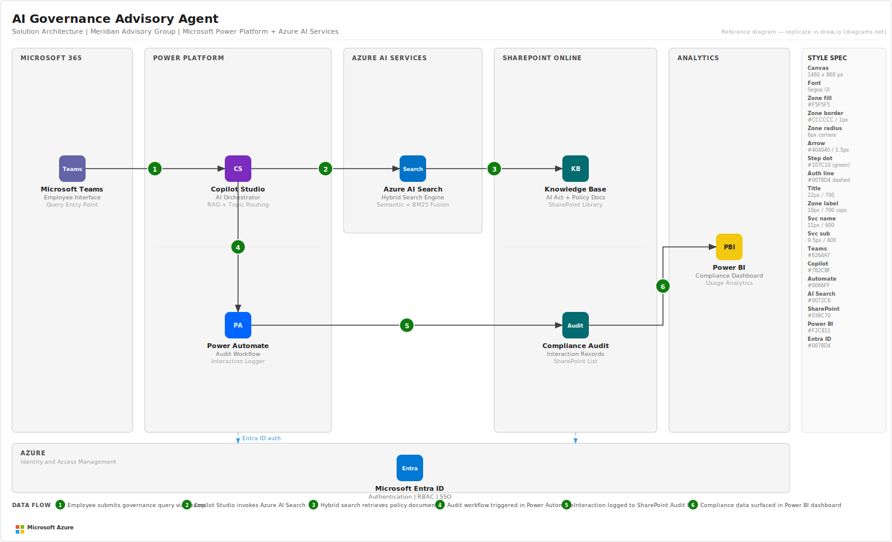

# AI Governance Advisory Agent
### End-to-End Microsoft AI Consulting Engagement (Portfolio Project)

**Arsh Wafiq Khan Chowdhury** · Technology Consultant · Microsoft AI and Power Platform
arshwafiq@gmail.com · [linkedin.com/in/arsh-wafiq-khan-chowdhury](https://linkedin.com/in/arsh-wafiq-khan-chowdhury)

---

## Solution Architecture



---

## Engagement Summary

This project documents a complete, end-to-end Microsoft AI consulting engagement following standard Microsoft partner delivery methodology. The client is Meridian Advisory Group, a 420-person professional services firm (simulated engagement for portfolio purposes).

The problem: knowledge workers were spending significant time searching across scattered documents and routing questions to a small team of AI specialists, creating bottlenecks, inconsistent answers, and no audit trail for compliance purposes.

The solution is a Copilot Studio agent deployed in Microsoft Teams, grounded in Azure AI Search on a curated SharePoint knowledge base. Staff can submit natural language governance queries and receive cited, sourced responses in under 10 seconds. All interactions are logged to SharePoint via Power Automate for audit and compliance purposes, with a Power BI dashboard for the Risk and Compliance team.

---

## Delivery Documents

Each document in the `docs/` folder is GitHub-readable. The same content is available as `.docx` for professional sharing.

| Phase | Document | What it covers |
|---|---|---|
| 1 | [Discovery and Requirements](docs/01_Discovery_Requirements.md) | Stakeholder map, pain points, functional and non-functional requirements, success criteria, scope |
| 2 | [Solution Design Document](docs/02_Solution_Design_Document.md) | Architecture overview, component design, data flow, security model, environment strategy |
| 3 | [Architecture Decision Record](docs/03_Architecture_Decision_Record.md) | Five ADRs: agent platform, search strategy, knowledge base storage, audit logging, reporting |
| 4 | [UAT Test Cases](docs/04_UAT_Test_Cases.md) | 15 test cases across query accuracy, escalation, audit logging, performance, and dashboard access |
| 5 | [Deployment Runbook](docs/05_Deployment_Runbook.md) | Step-by-step Production deployment guide: Azure AI Search, SharePoint, Power Automate, Copilot Studio, Power BI |

---

## Phase 1: Discovery

Structured discovery workshop with 12 Meridian staff across Legal, Risk, and Strategy. Outputs: stakeholder map, current state pain points, 8 functional requirements (MoSCoW prioritised), 6 non-functional requirements, and 5 measurable success criteria agreed with the executive sponsor.

Key finding: no single source of truth for AI governance policy, specialist availability as a single point of failure, and zero audit trail for guidance given.

[Read the Discovery document](docs/01_Discovery_Requirements.md)

---

## Phase 2: Solution Design

Full component architecture using the Retrieval Augmented Generation (RAG) pattern on the Microsoft stack. Copilot Studio at the centre, with Azure AI Search performing hybrid keyword and semantic retrieval across the SharePoint knowledge base. Power Automate handles audit logging. Power BI provides the compliance dashboard.

Key design choices: hybrid search with a 0.7 semantic confidence threshold (below threshold triggers SME escalation rather than a low-confidence generated response); SharePoint as the knowledge base to enable non-developer document management; Power Automate for audit logging to keep all data within the Meridian M365 tenant.

[Read the Solution Design](docs/02_Solution_Design_Document.md) · [Read the Architecture Decision Record](docs/03_Architecture_Decision_Record.md)

---

## Phase 3: Implementation

Build following the phased plan defined in the SDD. Power Platform Dev, Test, and Production environments provisioned (Default environment not used). Azure AI Search Standard tier configured in Australia East. Knowledge base seeded with EU AI Act, Meridian internal policy, and 12 priority guidance documents. Copilot Studio agent built with five topics including graceful escalation when confidence falls below 0.7. Power Automate audit flow and Power BI dashboard configured.

### Runnable Python Implementation

This repository includes a complete, production-ready Python implementation of the RAG backend. It directly exercises the Azure AI Search and Azure OpenAI SDKs — no abstraction layers or LangChain dependencies — to demonstrate how the retrieval and generation pipeline actually works under the hood.

```
src/
├── indexer/
│   ├── document_processor.py  # PDF (PyMuPDF) + DOCX extraction, tiktoken chunking
│   ├── search_index.py        # Azure AI Search index schema (HNSW + semantic config)
│   └── indexer.py             # Full indexing pipeline with rich progress output
├── search/
│   └── query_engine.py        # RAG query engine: embed → hybrid search → GPT-4o
└── audit/
    └── audit_logger.py        # JSONL local logging + optional SharePoint Graph API upload

scripts/
├── setup_infrastructure.py    # One-time Azure index creation + env validation
├── run_indexer.py             # Document indexing entry point (--dry-run supported)
└── test_queries.py            # 10 representative governance queries end-to-end

tests/
├── test_indexer.py            # Unit tests: chunking, IDs, document processing (offline)
└── test_search.py             # Unit tests: confidence bands, hybrid search, QueryEngine
```

**To run the backend locally:**

```bash
pip install -r requirements.txt
cp .env.example .env          # Fill in Azure credentials
python scripts/setup_infrastructure.py
python scripts/run_indexer.py
python scripts/test_queries.py
```

**To run the test suite (no Azure credentials needed):**

```bash
pytest tests/ -v
```

---

## Phase 4: User Acceptance Testing

15 test cases executed across five categories in the Test environment with 15 business users. Three defects found and resolved before sign-off. All test cases passed. UAT sign-off obtained from the CRO, Head of AI Practice, and UAT lead.

[Read the UAT Test Cases](docs/04_UAT_Test_Cases.md)

---

## Phase 5: Production Deployment

Step-by-step runbook covering Azure AI Search index creation, SharePoint library and audit list configuration, Power Automate managed solution import, Copilot Studio agent publication to Teams, and Power BI dashboard deployment. Includes a six-step post-deployment verification checklist and a rollback procedure.

[Read the Deployment Runbook](docs/05_Deployment_Runbook.md)

---

## Technology Stack

| Layer | Technology |
|---|---|
| Conversational agent | Microsoft Copilot Studio |
| Search and retrieval | Azure AI Search (hybrid BM25 + vector, semantic ranker, HNSW) |
| Language model | Azure OpenAI GPT-4o (generation) · text-embedding-ada-002 (embeddings) |
| RAG backend | Python 3.11 · azure-search-documents · openai SDK · pydantic-settings |
| Document processing | PyMuPDF (PDF) · python-docx (DOCX) · tiktoken (token-accurate chunking) |
| Knowledge base storage | SharePoint Online Document Library |
| Audit logging | Power Automate · SharePoint List · Microsoft Graph API |
| Compliance reporting | Power BI |
| Identity and access | Azure Active Directory |
| Deployment channel | Microsoft Teams |
| Infrastructure region | Azure Australia East |

---

## Knowledge Base

All content in the knowledge base is publicly available:

- EU AI Act full text and obligations summary (European Commission)
- Microsoft Responsible AI Principles (Microsoft public documentation)
- NIST AI Risk Management Framework 1.0 (US NIST)
- Australian Government AI Ethics Framework (DISR)
- ISO/IEC 42001:2023 AI Management System overview (publicly available summary)
- Meridian Advisory Group internal AI usage policy and AI risk classification guide (simulated, fictional)

---

## 2025–2026 Regulatory Context

This project is directly aligned with the AI governance landscape as it stands in early 2026:

**EU AI Act (in force August 2024):** The first comprehensive binding AI regulation globally. High-risk system obligations, prohibited practice bans, and foundation model requirements are all active. Organisations with EU exposure need a reliable internal reference system — exactly the use case this agent addresses.

**Australian Voluntary AI Safety Standard (November 2024):** Ten guardrails published by the Australian Government's DISR, covering testing, transparency, human oversight, and accountability. While voluntary, major enterprise and government buyers are beginning to require compliance as a procurement condition.

**Microsoft AI Governance announcements (2025):** Microsoft introduced its Responsible AI Standard v2 and expanded Microsoft Purview to cover AI-generated content classification and audit. The Microsoft 365 Copilot ecosystem, which this agent sits within, is now subject to the same data governance controls as email and documents — making audit logging and confidence-gated responses not just best practice, but increasingly a compliance requirement.

**ISO/IEC 42001:2023:** The AI management system standard gaining traction as an audit framework for enterprise AI deployments, particularly in financial services and government — Meridian's two primary client sectors.

The demand for AI governance advisory services is accelerating. This project demonstrates the ability to translate regulatory complexity into a practical, auditable enterprise tool — the core competency of a technology consultant working in this space.

---

## What This Project Demonstrates

This engagement covers the full Microsoft AI consulting delivery lifecycle from discovery through production deployment:

- Structured discovery and requirements gathering with business stakeholders
- Solution architecture using the RAG pattern on the Microsoft Power Platform and Azure stack
- Architecture decision-making with documented trade-off analysis using the ADR format
- Security and governance design covering data residency, RBAC, DLP, and audit requirements
- Power Platform environment strategy following Microsoft best practice (no Default environment)
- Test case design covering accuracy, escalation, logging, performance, and access control
- Production deployment documentation written for IT Operations administrators
- Compliance reporting design for a Chief Risk Officer audience
- **Runnable Python implementation** of the RAG backend using Azure SDK primitives directly — demonstrating engineering depth behind the no-code/low-code delivery surface
- Unit test suite with fully mocked Azure dependencies — tests chunking logic, confidence band classification, hybrid search filtering, and end-to-end query orchestration

---

*Arsh Wafiq Khan Chowdhury · Technology Consultant · Microsoft AI, Power Platform, Azure*
*Available immediately · 485 visa · Full work rights to January 2028 · Open to all Australian states*
