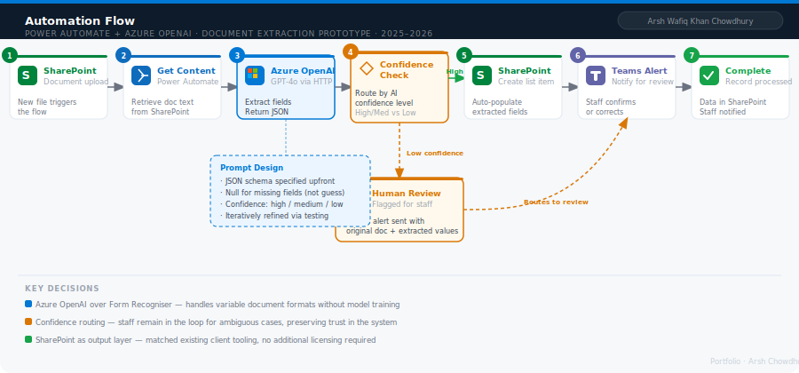

# Case Study: AI-Augmented Document Processing
## Power Automate + Azure OpenAI — Internal Capability Prototype

**Prepared by:** Arsh Wafiq Khan Chowdhury — Technology Consultant, Sydney NSW  
**Date:** 2025–2026 · **Version:** 1.0  
**Stack:** Power Automate · Azure OpenAI (GPT-4o) · SharePoint Online · Power Apps  
**Classification:** Portfolio artefact — client details sanitised

> This case study documents the design and delivery of an AI-augmented automation prototype built during a consulting engagement. It covers problem framing, options assessment, architecture design, and key decisions made throughout the build. The case study presents real world use cases of bottlenecks experienced by firms of all scale. Client details are sanitised and some details are fictionalised to guardrail sensitive / classified information. This is purely a Portolio Artefact to demonstrate my technical werewithal. 

---

## Context

During a consulting engagement, the firm identified a recurring operational pattern across multiple client engagements: staff were spending significant time manually reading incoming documents, extracting key information, and entering it into structured systems. The process was slow, error-prone, and created bottlenecks in workflows that depended on that structured data downstream.

The firm wanted to build and demonstrate an internal capability — an AI-augmented automation prototype — that could be presented to clients as a proof of concept for intelligent document processing. The goal was to show how Azure OpenAI, connected to Power Automate, could extract structured information from unstructured documents and route it into downstream systems automatically.

**My role:** End-to-end design and delivery of the prototype, including architecture decisions, Power Automate flow build, Azure OpenAI prompt engineering, and documentation of the solution for client-facing demonstration purposes.

---

## Problem Statement

### The Manual Process

Staff and clients were handling a high volume of incoming documents (forms, emails, reports) that contained information needing to be extracted and entered into structured systems. The existing process looked like this:

| Step | Activity | Time Cost | Error Risk |
|---|---|---|---|
| 1 | Document received (email or upload) | — | — |
| 2 | Staff reads document manually | 5–15 min/doc | Low |
| 3 | Staff extracts key fields by eye | 5–10 min/doc | Medium |
| 4 | Staff manually enters data into system | 5–10 min/doc | High |
| 5 | Data validated by supervisor | 5 min/doc | — |
| **Total** | **Per document** | **~20–40 min** | **Cumulative** |

At volume, this represented a significant and avoidable administrative burden. It was also the kind of task that causes staff frustration — repetitive, low-value, high-stakes if done wrong.

### The Design Question

Before building anything, the design question was framed clearly:

> *"Can we use Azure OpenAI to reliably extract structured data from unstructured documents, and can we connect that extraction reliably into a Power Automate flow that routes the output into a SharePoint list — without requiring staff to touch the document at all?"*

This framing was important. It kept the scope tight and the success criteria measurable.

---

## Options Considered

Three approaches were assessed before committing to the build direction.

### Option 1: Azure AI Document Intelligence (Form Recogniser)
Pre-built Azure service for structured document extraction using trained models.

**Pros:** High accuracy on structured forms, purpose-built for extraction, no prompt engineering required  
**Cons:** Requires model training on document templates, poor performance on unstructured or variable-format documents, higher per-page cost at volume

**Verdict:** Strong for structured, predictable forms. Not suitable for variable-format documents.

### Option 2: Azure OpenAI via Power Automate HTTP Connector — Selected
GPT-4o accessed via Azure OpenAI REST API, called from a Power Automate HTTP action with a structured prompt.

**Pros:** Handles variable document formats and unstructured text naturally, no model training required, prompt can be iterated rapidly, output easily shaped as JSON for downstream consumption  
**Cons:** Requires careful prompt engineering for consistent JSON output, token cost increases with document length, hallucination risk on ambiguous fields requires validation logic

**Verdict:** Best fit for the prototype scope. Flexibility and speed of iteration outweigh the need for careful prompt design.

### Option 3: Custom Python Function App on Azure Functions
Python script calling OpenAI API, deployed as an Azure Function, triggered by Power Automate.

**Pros:** Full control over logic, error handling, and retry behaviour, can handle complex multi-step extraction  
**Cons:** Significantly higher build complexity, requires Azure Functions infrastructure, harder for non-developers to maintain post-handover

**Verdict:** Appropriate for production at scale. Overkill for an internal proof of concept.

---

## Solution Design

**Selected approach: Option 2 — Azure OpenAI via Power Automate HTTP Connector**

### Architecture



### How It Works — Step by Step

| Step | Component | What Happens |
|---|---|---|
| 1 | SharePoint / Email trigger | Document arrives — either uploaded to a SharePoint library or received as an email attachment |
| 2 | Power Automate — Get file content | Flow retrieves the document content as text (plain text, or extracted from PDF via a conversion step) |
| 3 | Power Automate — HTTP action | Flow sends the document text to Azure OpenAI REST API with a structured extraction prompt |
| 4 | Azure OpenAI (GPT-4o) | Model reads the document and returns a JSON object containing the extracted fields |
| 5 | Power Automate — Parse JSON | Flow parses the JSON response and maps fields to SharePoint column values |
| 6 | Power Automate — Create item | Flow creates a new item in the target SharePoint list with extracted data pre-populated |
| 7 | Power Automate — Notify | Flow sends a Teams notification to the relevant staff member for review and confirmation |

### Prompt Engineering Approach

The Azure OpenAI prompt was designed around three principles:

**1. Output contract first.** The prompt specified the exact JSON schema expected before asking the model to do anything. This dramatically reduced variability in the output format.

**2. Explicit field handling for missing data.** The prompt instructed the model to return `null` for any field it could not confidently extract, rather than guessing. This made the validation logic downstream straightforward.

**3. Confidence signalling.** The prompt asked the model to include a `confidence` field (high / medium / low) for each extracted value. Low-confidence extractions triggered a human review flag in the Power Automate flow rather than writing directly to SharePoint.

Example prompt structure (sanitised):

```
You are a document extraction assistant. Extract the following fields from the document below and return them as a valid JSON object. If a field cannot be found or you are not confident in the value, return null for that field and set confidence to "low".

Required fields:
- document_date (ISO format)
- reference_number (string)
- subject_name (string)
- key_action (string, max 50 words)
- urgency_level (one of: low, medium, high, critical)

For each field, also return a confidence value: "high", "medium", or "low".

Document:
[DOCUMENT_TEXT]
```

### Validation Logic

A key design decision was building a confidence-based routing layer into the Power Automate flow:

```
IF any field confidence = "low"
  → Flag item in SharePoint as "Needs Review"
  → Send Teams message to reviewer with extracted values and original document link
  → Do NOT auto-populate the list item

IF all fields confidence = "high" or "medium"
  → Auto-populate SharePoint list item
  → Send Teams notification: "Document processed automatically — please verify"
```

This meant the automation was never fully autonomous — staff remained in the loop for ambiguous cases — which was deliberate. A prototype that occasionally gets things wrong without flagging it destroys trust. A prototype that flags uncertainty builds it.

---

## Key Design Decisions

### Decision 1: Use Power Automate HTTP connector rather than a custom connector

**Why:** The HTTP connector gave enough control for the prototype scope without the overhead of building and maintaining a custom connector. The trade-off was verbose flow configuration, which was acceptable given the prototype context.

### Decision 2: Return JSON with a schema, not free text

**Why:** Early testing showed that asking the model to "extract" without specifying output format produced inconsistent results — sometimes a list, sometimes prose, sometimes JSON without consistent field names. Specifying the schema in the prompt and instructing strict JSON output made parsing reliable.

### Decision 3: Confidence routing rather than binary pass/fail

**Why:** A binary approach (auto-process or reject) would have required near-perfect extraction accuracy to be useful. The confidence layer allowed the automation to deliver value on clear documents while gracefully degrading to human review on ambiguous ones. This is the design pattern used in production Azure AI Document Intelligence deployments and it was the right call for this context too.

### Decision 4: SharePoint as the output layer rather than Dataverse

**Why:** The target clients already had SharePoint in their Microsoft 365 stack. Dataverse would have required additional licensing and a more complex data model for a prototype. SharePoint lists were sufficient for demonstrating the concept and matched the client's existing tooling.

---

## Outcome

The prototype was completed and used internally to demonstrate AI automation capability to prospective clients. Key results:

| Metric | Before | After (Prototype) |
|---|---|---|
| Time per document | ~20–40 minutes | ~2–3 minutes (review only) |
| Manual entry errors | Present | Eliminated for auto-processed docs |
| Staff touchpoints per document | 4–5 | 1 (review and confirm) |
| Documents requiring human review | 100% | ~25–30% (low-confidence cases) |

The prototype demonstrated that the core pattern was viable. It also surfaced two findings that would inform a production build:

**Finding 1:** Document quality matters more than prompt quality. Poor scan quality and inconsistent formatting were the primary causes of low-confidence extractions, not model capability. A production version would need a document quality pre-check step.

**Finding 2:** The confidence routing layer was the most valuable design decision. Clients responded positively to the idea that the system would flag uncertainty rather than silently fail. This became a talking point in client demonstrations.

---

## What I Would Do Differently in Production

| Area | Prototype Approach | Production Recommendation |
|---|---|---|
| Document ingestion | SharePoint upload trigger | Azure Blob Storage with Event Grid trigger for higher volume and reliability |
| Text extraction | Plain text from SharePoint | Azure AI Document Intelligence for PDFs, with OpenAI as fallback for unstructured formats |
| Error handling | Basic condition checks | Retry logic with exponential backoff, dead letter queue for failed documents |
| Prompt versioning | Single prompt in flow | Prompt stored in SharePoint config list, versioned, editable without modifying the flow |
| Monitoring | Teams notifications only | Azure Application Insights for flow telemetry, extraction accuracy tracking over time |
| Authentication | API key in flow variables | Azure Key Vault for secure credential management |

---

## Technical Stack

| Component | Technology | Purpose |
|---|---|---|
| Trigger | Power Automate (SharePoint trigger) | Detects new document uploads |
| Document handling | Power Automate (Get file content) | Retrieves document as text |
| AI extraction | Azure OpenAI REST API (GPT-4o) | Extracts structured fields from document text |
| Flow logic | Power Automate (conditions, parse JSON) | Routes based on confidence, maps fields |
| Data storage | SharePoint Online Lists | Stores extracted and reviewed records |
| Notifications | Microsoft Teams (Power Automate connector) | Alerts staff for review and confirmation |

---

## Skills Demonstrated

This case study demonstrates the following consulting and technical capabilities:

- **Problem framing:** Articulating a vague operational problem as a testable design question with measurable success criteria
- **Options assessment:** Evaluating three credible technical approaches against the same criteria before committing to a direction
- **Prompt engineering:** Designing structured prompts for reliable JSON output from Azure OpenAI, including confidence signalling
- **Architecture decision making:** Justifying each major design decision with explicit trade-offs
- **Human-centred automation design:** Building confidence routing to keep staff in the loop rather than creating a fully autonomous system that erodes trust
- **Production thinking:** Identifying the gap between prototype and production and documenting it honestly

---

*Prepared by Arsh Wafiq Khan Chowdhury — Technology Consultant, Sydney NSW*  
*arshwafiq@gmail.com · [linkedin.com/in/arsh-wafiq-khan-chowdhury](https://linkedin.com/in/arsh-wafiq-khan-chowdhury)*  
*[github.com/Arshchowdhury/Portfolio_ArshWafiqKhanChowdhury](https://github.com/Arshchowdhury/Portfolio_ArshWafiqKhanChowdhury)*
