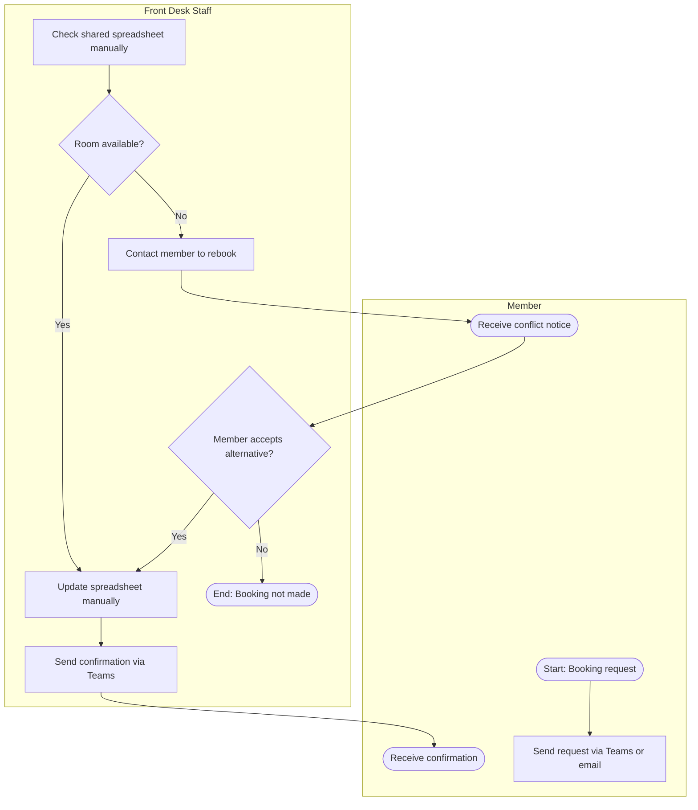
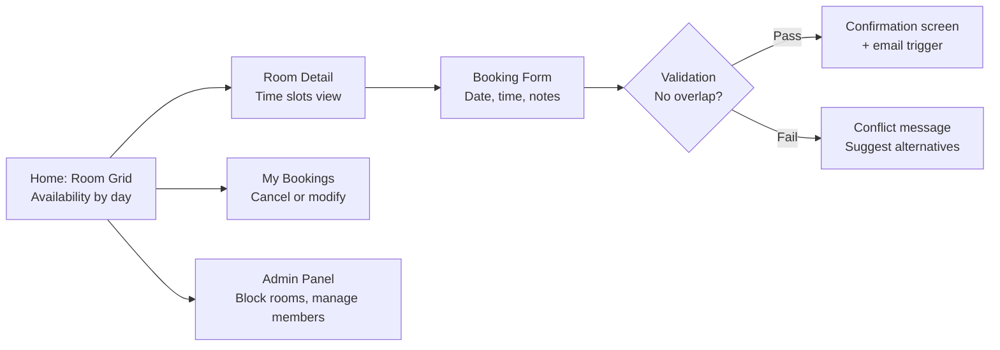

# Case Study 01 — Northgate Co-working: Room Booking System

> **Simulated engagement.** Fictional company and scenario used to demonstrate end-to-end consulting methodology, BA frameworks, and Power Platform delivery practice.

**Industry:** Facilities Management / SME
**Stack:** Power Apps (canvas), Power Automate, SharePoint Online, Microsoft 365
**Engagement type:** End-to-end implementation (discovery through go-live)

---

## The Problem

Northgate Co-working is a 50-person managed workspace in Sydney's CBD. Members book meeting rooms, hot desks, and event spaces through a combination of a shared spreadsheet, Teams messages, and verbal requests to front-desk staff.

The resulting issues were predictable: double bookings, no cancellation visibility, no audit trail, and front-desk staff spending significant time each week managing and resolving conflicts rather than supporting members. The client had a Microsoft 365 Business Standard licence in place but was not using it beyond email and Teams.

**Objective:** Replace the manual booking process with a self-service digital system that non-technical staff could manage and maintain without ongoing vendor support.

**Constraints:**
- No additional software licensing budget
- Must be operable by non-technical front-desk staff
- Target delivery: 4 weeks from discovery to go-live

---

## Discovery

### SIPOC

| | S — Suppliers | I — Inputs | P — Process | O — Outputs | C — Customers |
|---|---|---|---|---|---|
| | Members, front-desk staff, building management | Booking requests (verbal, Teams, email), room availability, member roster | Room booking management — receiving requests, checking availability, confirming, communicating, resolving conflicts | Booking confirmation, room assignment, cancellation notice | Members (individuals and teams), front-desk staff, building management |

**Scope boundary (from SIPOC):** Process starts when a member makes a booking request. Process ends when the member receives a confirmation or the conflict is resolved.

---

### Current State Process — BPMN Swim Lane

**Key pain points identified in discovery workshop:**
- No real-time visibility — staff check the spreadsheet after receiving each request
- No cancellation flow — members message front-desk individually; spreadsheet rarely updated
- No recurring booking support — weekly team rooms manually re-entered each week
- No admin hold — rooms cannot be blocked for cleaning or maintenance without removing them from the spreadsheet entirely

---

### Requirements Register (excerpt)

| ID | Requirement | Priority | Source | Notes |
|---|---|---|---|---|
| REQ-01 | Members must be able to view real-time room availability | Must Have | Discovery workshop | Current spreadsheet creates lag and conflicts |
| REQ-02 | Booking creation must validate against existing bookings and prevent overlap | Must Have | Front-desk staff | Core functional requirement |
| REQ-03 | System must send automated email confirmation on booking creation | Must Have | Member feedback | Currently done manually |
| REQ-04 | Admin must be able to block rooms for maintenance without affecting the booking view | Must Have | Operations manager | Not possible in current state |
| REQ-05 | Members must be able to cancel a booking and free the room in real time | Must Have | Front-desk staff | Currently done informally |
| REQ-06 | System should support recurring bookings (weekly pattern) | Should Have | Operations manager | High-volume manual effort today |
| REQ-07 | 15-minute hold on a room without confirmed booking | Should Have | Operations manager | Surfaced in workshop; not in original brief |
| REQ-08 | Mobile-accessible interface | Could Have | Member feedback | Nice to have; not business-critical |

---

## Solution Design

### Decision: Power Apps Canvas App on SharePoint

Given the existing Microsoft 365 licence, no Dataverse entitlement, and the need for front-desk staff to maintain the system independently, a Power Apps canvas app backed by SharePoint lists was chosen over a custom web application or third-party tool.

**Trade-offs acknowledged:**
- SharePoint as a data layer limits scalability beyond ~500 items per list before performance degrades (mitigated with indexed columns and delegable queries)
- Canvas apps are not ideal for complex relational data, but the booking data model is flat enough that this is acceptable

### Data Model (SharePoint Lists)

| List | Key Columns | Purpose |
|---|---|---|
| Rooms | RoomID, Name, Capacity, Floor, Active | Room catalogue and availability config |
| Bookings | BookingID, RoomID, MemberID, StartTime, EndTime, Status, RecurringID | Core booking records |
| Members | MemberID, Name, Email, Company, Active | Member directory |
| AdminBlocks | BlockID, RoomID, StartTime, EndTime, Reason | Admin-managed room holds |

### Screen Flow

### Automation (Power Automate flows)

| Flow | Trigger | Action |
|---|---|---|
| Booking Confirmation | New item in Bookings list (Status = Confirmed) | Send email to member with booking details and calendar invite |
| Cancellation Notice | Bookings item updated (Status = Cancelled) | Send cancellation email; notify front-desk if admin-initiated |
| 15-Minute Hold Expiry | Scheduled (every 5 min) | Check Bookings for Status = Hold older than 15 min; update to Expired |
| Recurring Booking Generator | Weekly scheduled trigger | Read RecurringID records; auto-create next week's booking instances |

---

## Testing and Deployment

### UAT Summary

Two UAT rounds were conducted before go-live:

**Round 1 — Functional (Operations Manager)**
- 12 test cases covering all REQ-01 to REQ-07 scenarios
- 3 defects found: overlap validation not firing on same-minute bookings, recurring flow creating duplicate entries on Tuesdays, admin block not surfacing on room grid
- All 3 resolved and retested before Round 2

**Round 2 — Usability (Front-desk staff, 2 participants)**
- Unstructured task-based testing: "Book the boardroom for Friday 2pm for 2 hours"
- 1 usability issue: confirmation button placement not visible on smaller screens — resolved with layout adjustment
- Both staff rated the system as easy to use; no training required beyond the handover session

### Deployment

App published via SharePoint site embed for front-desk access. Admin panel access restricted by M365 security group. All SharePoint lists permission-scoped to prevent accidental direct edits.

---

## Outcome

| Metric | Before | After |
|---|---|---|
| Double bookings per week | ~3-4 (estimated) | 0 (post go-live, 4 weeks tracked) |
| Front-desk time on booking admin | ~2.5 hrs/week (estimated) | ~20 min/week (confirmation review only) |
| Cancellation lag (time to free room) | Minutes to hours (manual) | Real-time |
| Recurring bookings | Manual re-entry weekly | Automated |

---

## Reflections

The 15-minute hold and admin override requirements both emerged from the discovery workshop — neither appeared in the original brief. This is consistent with what tends to happen when you map the actual process rather than accepting a written specification: the brief describes what people wish existed, the workshop reveals what they actually need.

The decision to use SharePoint over Dataverse was worth documenting explicitly in the solution design. Clients often assume the more capable option is always better; in this case, the simpler data layer was the right call for maintainability and cost.
