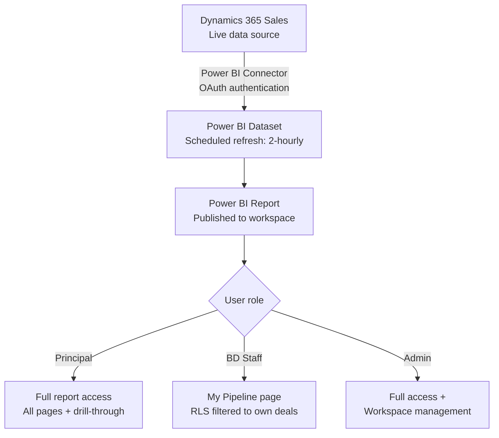

# Case Study 02 — Summit Advisory: Sales Pipeline Dashboard

> **Simulated engagement.** Fictional company and scenario used to demonstrate end-to-end consulting methodology, BA frameworks, and Power BI delivery practice.

**Industry:** Professional Services / Advisory
**Stack:** Power BI, Microsoft Dynamics 365 Sales, DAX, SharePoint Online
**Engagement type:** Analytics and reporting implementation (requirements through go-live)

---

## The Problem

Summit Advisory is a mid-sized management consulting firm with 12 business development staff and 4 principals. Sales pipeline tracking was done by exporting data manually from Dynamics 365 into Excel, formatting it, and distributing a static report to principals each Monday morning. The process took approximately 3 hours per week and produced a report that was already out of date by the time it was read.

**Specific pain points identified:**
- No real-time pipeline visibility between Monday reports
- Revenue forecasting relied on a manually maintained Excel model with no connection to actual deal data
- Principals could not drill into deal-level detail from the summary report
- Stage conversion rates were never calculated — the business had no view of where deals were being lost
- Two different staff maintained different versions of the Excel file, leading to discrepancies in the Monday report

**Objective:** Replace the manual Excel reporting process with a live Power BI dashboard connected directly to Dynamics 365, giving principals and BD staff on-demand pipeline visibility with drill-through capability.

---

## Discovery

### Current State vs Future State — Gap Analysis

| Dimension | Current State | Gap | Future State |
|---|---|---|---|
| **Data source** | Manual export from Dynamics 365 to Excel | No live connection to source system | Power BI connected directly to Dynamics 365 via connector |
| **Refresh frequency** | Weekly (Monday morning) | 167 hours of stale data per cycle | Near real-time (scheduled refresh every 2 hours) |
| **Access** | Email distribution to principals only | BD staff have no self-service access | Role-based access via Power BI workspace |
| **Pipeline by stage** | Static table in Excel | No visual pipeline funnel | Interactive funnel chart with stage drill-through |
| **Revenue forecast** | Manual calculation in separate Excel model | Disconnected from live deal data | DAX-calculated weighted forecast based on stage probability |
| **Stage conversion rates** | Not calculated | No visibility of where deals are lost | Win/loss rate by stage; trend over rolling 12 months |
| **Deal-level detail** | Requires separate Dynamics 365 login | Friction prevents regular use | Drill-through from summary to deal record in same report |
| **Version control** | Multiple Excel files maintained by different staff | Discrepancy risk | Single source of truth in Power BI |

---

## Solution Design

### Data Model

Three tables pulled from Dynamics 365 via the certified Power BI connector, with one supporting SharePoint table:

```
Opportunities (fact)
├── OpportunityID
├── AccountID (FK → Accounts)
├── OwnerID (FK → Users)
├── Stage (Discovery / Proposal / Negotiation / Closed Won / Closed Lost)
├── EstimatedRevenue
├── StageProbability (%)
├── CloseDate (estimated)
├── ActualCloseDate
├── CreatedDate
└── Status

Accounts (dimension)
├── AccountID
├── AccountName
├── Industry
└── Tier (A/B/C)

Users (dimension)
├── UserID
├── FullName
└── Team

StageProbability (reference — SharePoint)
├── Stage
└── DefaultProbability (overrideable per deal)
```

**Relationships:** Star schema. Opportunities as the fact table. Date table generated via DAX for time intelligence.

---

### Key DAX Measures

```dax
-- Weighted pipeline value
Weighted Pipeline =
SUMX(
    Opportunities,
    Opportunities[EstimatedRevenue] * Opportunities[StageProbability] / 100
)

-- Stage conversion rate (Discovery → Proposal)
Discovery to Proposal Rate =
DIVIDE(
    CALCULATE(COUNTROWS(Opportunities), Opportunities[Stage] = "Proposal"),
    CALCULATE(COUNTROWS(Opportunities), Opportunities[Stage] IN {"Discovery", "Proposal", "Negotiation", "Closed Won", "Closed Lost"}),
    0
)

-- Rolling 12-month win rate
Win Rate (12M) =
DIVIDE(
    CALCULATE(COUNTROWS(Opportunities),
        Opportunities[Status] = "Closed Won",
        DATESINPERIOD('Date'[Date], LASTDATE('Date'[Date]), -12, MONTH)),
    CALCULATE(COUNTROWS(Opportunities),
        Opportunities[Status] IN {"Closed Won", "Closed Lost"},
        DATESINPERIOD('Date'[Date], LASTDATE('Date'[Date]), -12, MONTH)),
    0
)

-- Average deal cycle time (days)
Avg Deal Cycle Days =
AVERAGEX(
    FILTER(Opportunities, Opportunities[Status] = "Closed Won"),
    DATEDIFF(Opportunities[CreatedDate], Opportunities[ActualCloseDate], DAY)
)
```

---

### Report Structure

| Page | Purpose | Key Visuals |
|---|---|---|
| Pipeline Overview | At-a-glance for principals | Funnel by stage, weighted value card, deal count by owner |
| Forecast | Revenue projection | Waterfall chart (expected close by month), weighted vs unweighted toggle |
| Conversion Analysis | Where deals are lost | Stage conversion rates (bar), win/loss by industry, avg cycle time |
| Deal Detail | Individual deal drill-through | Table with all deal fields; triggered from Overview |
| My Pipeline | Personal view for BD staff | Filtered to current user via RLS (row-level security) |

---

## Process Flow — Report Refresh and Access



---

## Testing

| Test Type | Scope | Result |
|---|---|---|
| Data validation | Weighted pipeline total vs Dynamics 365 manual calculation | Matched within 0.1% (rounding on probability field) |
| RLS testing | BD staff view — confirmed deals from other owners not visible | Pass |
| Refresh reliability | 2-hour scheduled refresh over 2-week period | 100% success rate; 0 failed refreshes |
| DAX measure accuracy | Win rate and conversion rates cross-checked against manual Excel calculation | Exact match |
| Drill-through | All funnel stages clickable through to Deal Detail page | Pass |

---

## Outcome

| Metric | Before | After |
|---|---|---|
| Time spent on Monday report | ~3 hrs/week | Eliminated |
| Data freshness | Weekly (Monday only) | Every 2 hours |
| Pipeline visibility for BD staff | None (email only) | Self-service, real-time |
| Stage conversion tracking | Not calculated | Live, rolling 12-month view |
| Revenue forecast accuracy | Manual estimate, not connected to deal data | Weighted DAX forecast from live pipeline |

---

## Reflections

The gap analysis was the most valuable artefact from this engagement. Before running it, the client framed the problem as "we need a better Excel report." The gap analysis reframed it: the real issue was that the data source was wrong, not the report format. Moving from a weekly Excel export to a live Dynamics 365 connection was the fix, and the reporting was almost secondary.

Row-level security is worth planning early. It was almost left out of scope, but once BD staff understood they could access a personal pipeline view, it became a key adoption driver. Secure self-service access changed the engagement model from "report for principals" to "tool for the whole sales team."
