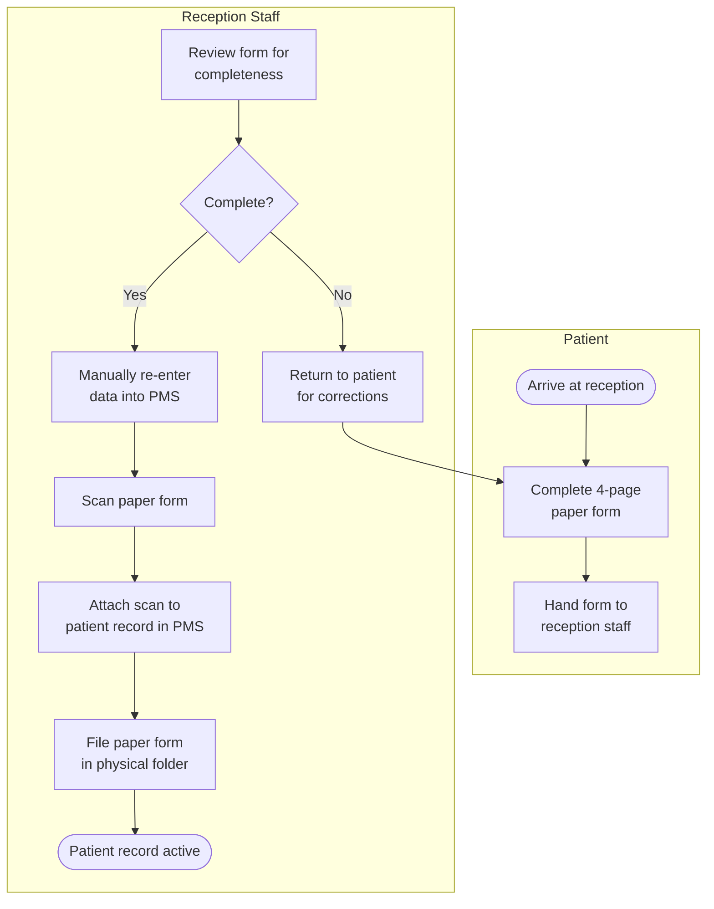
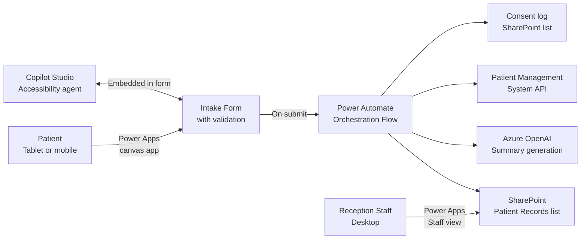

# Case Study 03 — Clearpath Health: Digital Intake Automation

> **Simulated engagement.** Fictional company and scenario used to demonstrate end-to-end consulting methodology, BA frameworks, and Power Platform + Azure OpenAI delivery practice.

**Industry:** Healthcare / Community Services
**Stack:** Power Apps (canvas), Power Automate, SharePoint Online, Azure OpenAI (GPT-4), Copilot Studio
**Engagement type:** End-to-end implementation with AI-augmented document processing

---

## The Problem

Clearpath Health is a community healthcare provider operating across three sites in Sydney. New patients complete a paper-based intake form at reception — a 4-page document covering personal details, medical history, current medications, GP information, and consent. Staff then manually re-enter this information into the patient management system, attach a scanned copy to the patient record, and file the original paper form.

The process took an average of 22 minutes per new patient intake (reception staff estimate). Errors in data transcription were common, particularly for medication names and dosages. Paper forms were stored in physical folders on-site, creating accessibility and compliance risk under the client's healthcare data obligations.

**An additional scope gap emerged during discovery:** A significant portion of intake forms were being submitted by or on behalf of patients with low English literacy. The existing form offered no accessibility support, and staff were spending unplanned time assisting patients through the form verbally — often in the waiting room, compromising privacy.

**Objective:** Digitise the intake process with a self-service patient-facing form, automate data capture into the patient management system, and introduce AI-assisted form guidance for accessibility.

---

## Discovery

### SIPOC

| | S — Suppliers | I — Inputs | P — Process | O — Outputs | C — Customers |
|---|---|---|---|---|---|
| | Reception staff, patients, referring GPs | Paper intake form, patient ID, GP referral letter (where applicable) | New patient intake — form completion, data entry, scanning, filing | Patient record created, consent captured, scanned form archived | Clinical staff, patient management system, compliance/audit |

**Scope boundary:** Process starts when the patient presents at reception for a new intake. Process ends when the patient record is confirmed in the patient management system and consent is captured.

---

### Current State Process — BPMN Swim Lane

**Pain points from discovery workshop:**

| Pain Point | Frequency | Impact |
|---|---|---|
| Transcription errors (medication names, dosages) | ~2-3 per week | Clinical risk — errors flagged by nursing staff |
| Incomplete forms returned to patient | ~30% of new intakes | Delays; patient experience impact |
| Accessibility gap for low-literacy patients | Estimated 15-20% of patients | Unplanned staff time; privacy concern |
| Paper form retrieval for audit | On request (varies) | Time-consuming; risk if form misfiled |
| After-hours intake (phone/email referrals) | ~5 per week | No digital option; forms emailed as PDFs, printed, then re-entered |

---

### Requirements Register

| ID | Requirement | Priority | Source |
|---|---|---|---|
| REQ-01 | Patient-facing digital form accessible on tablet (reception) and mobile (pre-arrival link) | Must Have | Operations Manager |
| REQ-02 | Form must validate required fields before submission | Must Have | Reception Staff |
| REQ-03 | Submitted data must auto-populate the patient management system without manual re-entry | Must Have | Clinic Director |
| REQ-04 | Digital consent must be captured and stored with audit timestamp | Must Have | Compliance obligation |
| REQ-05 | Submitted intake record must be searchable by patient name and date | Must Have | Reception Staff |
| REQ-06 | AI-assisted form guidance available in plain English for accessibility | Should Have | Discovery — surfaced in workshop |
| REQ-07 | Staff dashboard to review pending and completed intakes | Should Have | Reception Staff |
| REQ-08 | Pre-arrival intake link sent automatically after appointment booking | Could Have | Operations Manager |
| REQ-09 | Multi-language support (Simplified Chinese, Arabic as priority) | Could Have | Site managers |

---

## Solution Design

### Architecture Overview

### Component Design

**1. Patient-facing intake form (Power Apps canvas)**
- Section-by-section layout (5 screens: personal, medical history, medications, GP info, consent)
- Inline validation with plain-language error messages
- Progress indicator across screens
- Signature capture for digital consent (pen input control)
- Accessible colour contrast and font sizing per WCAG 2.1 AA guidelines

**2. Accessibility agent (Copilot Studio)**
- Embedded as a chat panel within the Power Apps form
- Triggered when patient taps "Help me fill this in"
- Agent explains each form field in plain English on request
- Does not pre-fill the form — guidance only, maintaining data integrity
- Knowledge source: internal FAQ document covering common questions about each field

**3. Orchestration flow (Power Automate)**
- Triggered on form submission
- Parallel branches: write to SharePoint, call patient management system API (via HTTP connector), generate AI summary, write consent log
- Error handling: if PMS API call fails, item is flagged in SharePoint for manual follow-up with alert to reception staff

**4. AI summary (Azure OpenAI — GPT-4)**
- Receives structured intake JSON from Power Automate
- Generates a plain-English clinical summary (3-5 sentences) for the patient record
- Example output: *"Patient presents as a 67-year-old with a history of Type 2 diabetes (managed, insulin) and hypertension. Current medications include Metformin 500mg (twice daily) and Lisinopril 10mg (once daily). No known allergies. GP is Dr. Sarah Lim at Marrickville Medical Centre. Consent to treatment and data storage provided."*
- Summary appended to SharePoint record alongside raw form data

**5. Staff dashboard (Power Apps — staff view)**
- Today's intakes with status (Pending PMS sync / Complete / Failed)
- Search by name or date
- View full intake data and AI summary side by side
- Manual re-trigger option for failed PMS sync records

---

## Value Stream Map — Future State

| Step | Value-Adding? | Time (Future State) | Notes |
|---|---|---|---|
| Patient completes digital form | Yes | 8-10 min (self-service) | Down from 22 min combined |
| Validation and submission | Yes | <1 min (automated) | Replaces staff review step |
| Data written to SharePoint + PMS | Yes | <30 sec (automated) | Replaces 12-min manual re-entry |
| Consent captured and logged | Yes | Automated, 0 min staff time | Audit-ready timestamp |
| Reception staff review | Yes | 2-3 min (exception management only) | Only for flagged/failed records |
| **Total** | | **~11-14 min** | **Down from ~22 min** |

---

## Testing

| Test Type | Scope | Result |
|---|---|---|
| Form validation | 23 field validation rules | All pass — boundary and negative test cases included |
| PMS API integration | Create and update patient record via HTTP connector | Successful across all test patient profiles |
| Consent log integrity | Timestamp, patient ID, and signature blob stored correctly | Pass |
| AI summary quality | 15 sample patient profiles reviewed by clinical staff | Approved; 2 edge cases (no current medications, paediatric patient) prompted minor prompt revision |
| Accessibility agent | 8 user test sessions with reception staff role-playing low-literacy patients | Rated helpful; response time <3 sec; 0 incorrect guidance instances |
| Failed sync recovery | PMS API call deliberately blocked; manual re-trigger tested | Pass — alert triggered, re-trigger successful |

---

## Outcome

| Metric | Before | After |
|---|---|---|
| Average intake process time (staff) | ~22 min per patient | ~3 min (exception handling only) |
| Transcription errors per week | ~2-3 | 0 (data flows direct from patient to PMS) |
| Incomplete forms at submission | ~30% returned for correction | <5% (inline validation prevents submission) |
| Paper form storage | Physical folders, 3 sites | Eliminated |
| After-hours intake | Not supported | Supported via pre-arrival mobile link |
| Accessibility support | Ad hoc, verbal, in waiting room | Self-service AI guidance, in-form |

---

## Reflections

The accessibility scope gap — discovered during the requirements workshop, not in the original brief — turned out to be one of the more consequential findings. The AI-assisted guidance component (Copilot Studio agent embedded in the form) addressed a genuine clinical and compliance risk that the client had not articulated because they had normalised the workaround. Structured discovery surfaced it.

The Azure OpenAI summary generation required careful prompt design. The initial prompt produced summaries that were clinically accurate but too long for the way clinical staff actually use intake records. Two iterations with a nurse practitioner in the room produced a prompt that consistently generated summaries in the 3-5 sentence range in the correct clinical register. The lesson: AI output quality is a requirements problem, not just a technical one.
